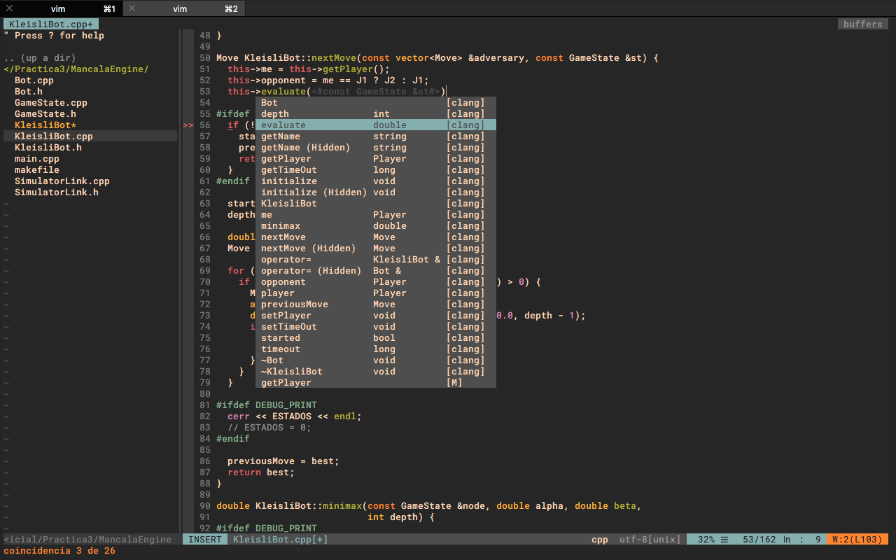
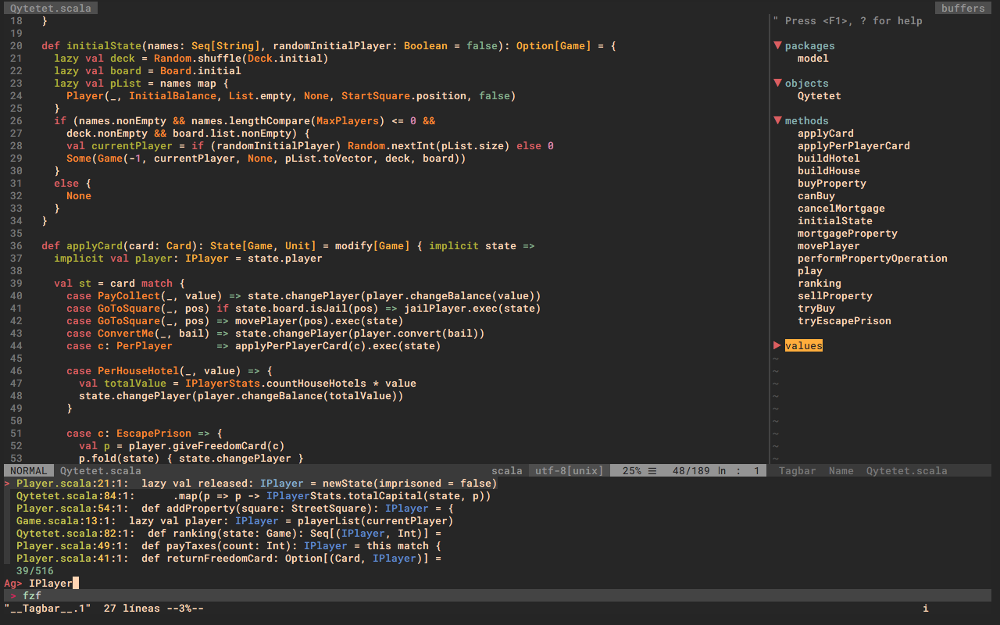
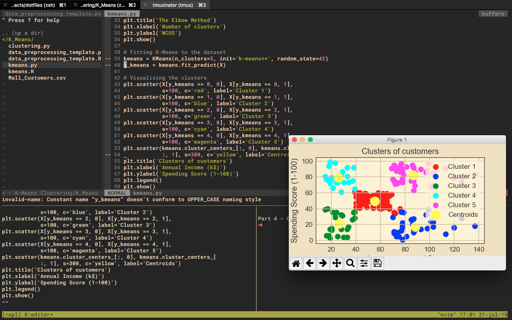
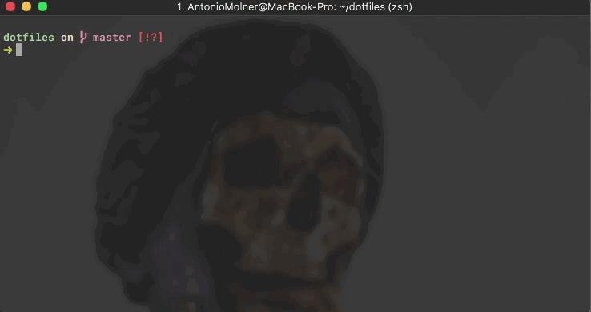
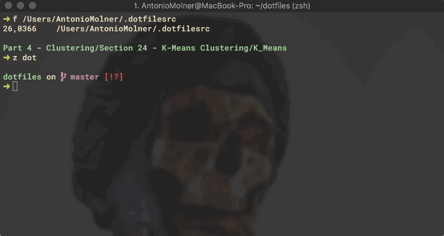

# antoniomdk's dotfiles

My personal configuration files for zsh, neovim, tmux, iterm, tmuxinator...

## Neovim

#### Editor

Powerful fully-featured editor.

* Special support for: C++, Python, Scala and Haskell (other filetypes are supported as well)
* Code completion
* File browser
* Formatting tools
* Fuzzy searching
* Tag management and exploring
* A lot of more feautures...





#### Tmux integration for REPLs



It is possible to make the editor work with external REPLs in a simple way.

- Support for most REPL: ipython, R, ihaskell, scala...

- Automatic layout creation by [tmuxinator](https://github.com/tmuxinator/tmuxinator)

- See [vim-slime](https://github.com/jpalardy/vim-slime) for details

  

## Terminal

### Enhanced ls


I prefer [exa](https://github.com/ogham/exa) over ls, so I have aliases for **l, la** and **ll**


### Enhanced cd



Interactive directory navigation thanks to [fzf](https://github.com/junegunn/fzf) and [enhancd](https://github.com/b4b4r07/enhancd)


### Fast navigation



Ultra fast navigation through directories and files thanks to [fasd](https://github.com/clvv/fasd)


## Requirements

I use Homebrew package manager that allows me to deal with dependencies easily. If you use it too, run this code to install the required packages.

```bash
brew update
# Fuzzy finder
brew install fzf
# Enhanced cd
https://github.com/b4b4r07/enhancd.git  $HOME/utils/enhancd
brew install fasd
# Enhanced ls
brew install exa
# Install Neovim
brew install neovim
```

If you use Linux or Homebrew isn't for you, follow the install instructions of each package  to get everything working. In case that you don't want to use some tool, just don't install it, but make sure the aliases and other related files are changed.

**Neovim** requires python2 and python3 support to work correctly so, make sure your system has python2 and python3 installed. In order to install de python support for Neovim, use the following:

```bash
pip2 install neovim
pip3 install neovim
```

 TODO

...