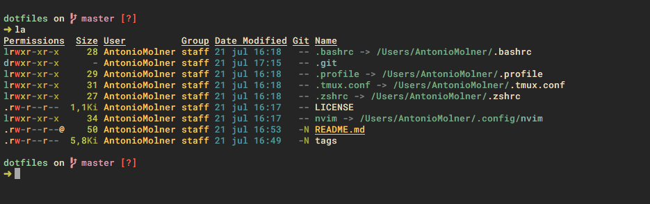

# antoniomdk's dotfiles

## Neovim

#### Editor

Powerful all-in-one editor.

* Special support for: C++, Python, Scala and Haskell (other filetypes are supported as well)
* File browser
* Formatting tools
* Fuzzy searching
* Tag exploring and management
* A lot of more feautures...

#### Tmux integration for REPLs

It is possible to make the editor work with external REPLs in a simple way.

- Support for most REPL: ipython, R, ihaskell, scala...

- Automatic layout creation by [tmuxinator](https://github.com/tmuxinator/tmuxinator)

- See [vim-slime](https://github.com/jpalardy/vim-slime) for details

  

## Terminal

#### Enhanced ls

I prefer [exa](https://github.com/ogham/exa) over ls, so I have aliases for: **l, la, ll**

#### Enhanced cd

TODO

### Fast navigation

TODO

## Requirements

TODO